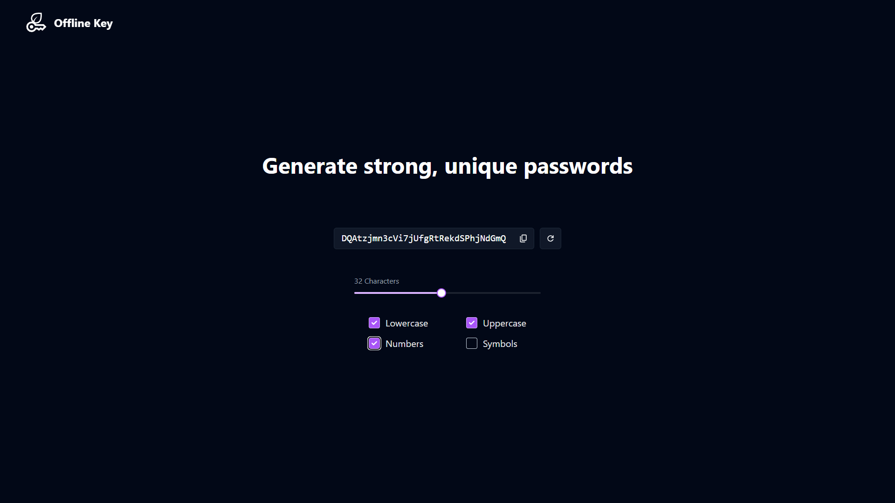

## Offline Key
An offline password generator that works completely without an internet connection. Generate secure, random passwords locally and keep your credentials safe.
<hr>

### Screenshots


### Features
- **Offline Functionality**: No network connection required for generating passwords.
- **Secure & Random**: Uses strong randomization algorithms to create secure passwords.
- **Progressive Web App (PWA)**: Installable on your device for quick access.
- **Auto-save Preferences**: Automatically saves and restores user settings between sessions using localStorage.
- **Modern Tech Stack**: Built using TypeScript, TailwindCSS, Vite, and enhanced with PWA support.
<hr>

### Technologies
- **TypeScript**: For type-safe, scalable code.
- **TailwindCSS**: For rapid UI development.
- **Vite**: A fast build tool and development server.
- **vite-plugin-pwa**: Adds PWA support to the project.
- **Docker**: Contains a Dockerfile for containerized deployments.
<hr>

### Usage
Simply launch the app hosted locally (see Installation instructions) or visit the [live project](https://offlinekey.yashanksingh.in). <br>
Follow the on-screen instructions to generate a new password. The interface is designed to be simple and user-friendly for quick password generation.
<hr>


### Installation
Make sure you have `Node` and `npm` installed. <br>
These instructions will help you get set up with a local development environment

1. Clone the repository:
   ```shell
   git clone https://github.com/yashanksingh/offline-key.git
   cd offline-key
   ```
2. Install dependencies: 
   ```shell
   npm install
   ```
3. Run in development mode:
   ```shell
   npm run dev
   ```
4. Build for production:
   ```shell
   npm run build
   ```
5. Preview the production build:
   ```shell
   npm run preview
   ```
<hr>

### Deployment using Docker
Make sure you have `Docker` installed. <br>

All the necessary files are located at `root`. <br>e.g. `Dockerfile`, `.dockerignore` and `nginx.conf`. <br>

Follow these steps to deploy the application using Docker

1. Build the Docker image:
   Run the following command in your terminal:
   ```shell 
   sudo docker build -t offline-key .
   ```

2. Run the Docker container <br>
   To run the container, use:
   ```shell
   sudo docker run --name offline-key -d -p 3000:3000 offline-key
   ```
   This command does the following: <br>
   **-d**: Runs the container in detached mode. This means the container will keep running in the background.<br>
   **-p 3000:3000**: Maps port 3000 of the host to port 3000 on the container. <br>

Then, open your browser at http://localhost:3000 to see the app in action.
<hr>

### Contributing
Contributions are welcome! Feel free to open issues or submit pull requests.
<hr>

### License
MIT License